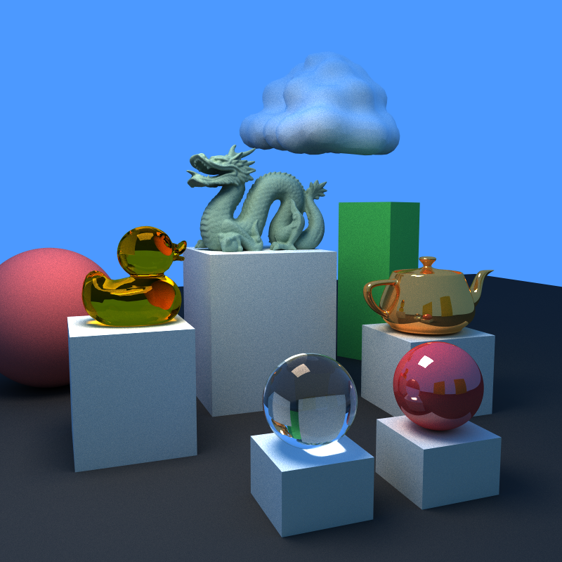
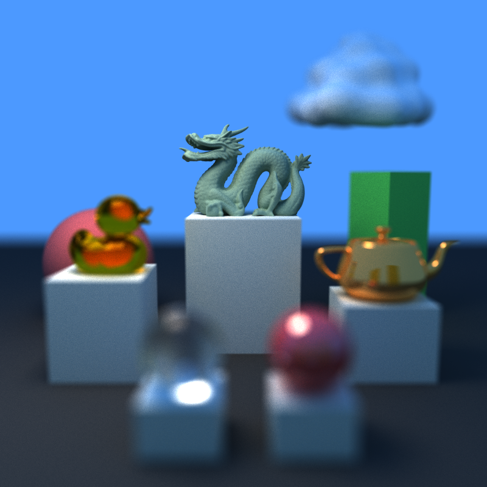
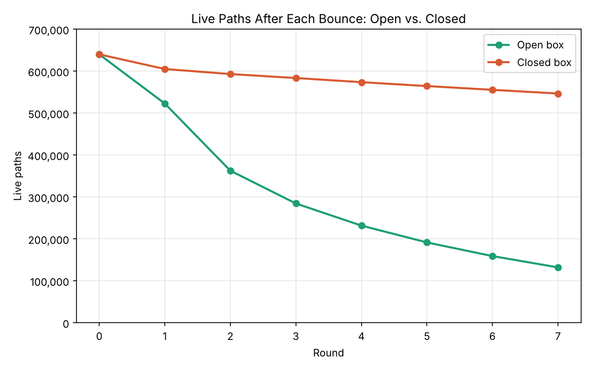

CUDA Path Tracer
================

**University of Pennsylvania, CIS 565: GPU Programming and Architecture, Project 3**

* Ryan Morris
  * [LinkedIn](www.linkedin.com/in/r19)
* Tested on: Windows 11, Intel i7-12700H @ 2.3GHz 64GB, GeForce RTX 3070 Ti Laptop GPU 8GB

&nbsp;&nbsp;&nbsp;&nbsp;&nbsp;&nbsp;

## Discussion of Features

### Shading Kernels and Initial Optimizations
- **Shading**: This project's shading is implemented in a new shading kernel `shadeRealMaterial` located in `pathtrace.cu`. This shader, for a given intersection, retrieves the material, and updates the color based on the material's emittance as a termination condition (e.g., reaching a light source), or calculates the ray's next bounce with `scatterRay`
- `scatterRay`, defined in `interactions.cu`, dictates the logic by material
	- For diffuse material, the next direction is sampled from the cosine-weighted direction with the provided `calculateRandomDirectionInHemisphere`
	- For reflective material, the probability of the direction being determined by diffusion (above) and a direct `glm::reflect` (mirror effect, angle in matching angle out) is based on the weighting of the reflect vs. refract color defined in the scene file for that particular type of object
	- For refractive material, see in-depth discussion in a later section

- **Optimization: Sorting paths by material** (`SORT_BY_MATERIAL`): When this optimization flag is set to 1 in the preprocessor instruction, before shading, `thrust::sort_by_key` sorts the intersections and path segments device arrays by `materialId`. This way, threads in the same warp shade the same material where possible.
	- *Analysis:* Test ran on initial settings, 800x800px `scenes/cornell.json`

- **Optimization: Stream compaction** Instead of having one single kernel gather all colors to write-back to the image at the end, terminated paths (e.g., hits light source, leaves scene) after each bounce, terminated paths (misses, light hits, or no bounces left) are added to the image and removed with `thrust::remove_if`, reducing the number of warps that need to be launched for later iterations, as not all of the initial rays will make it to the end
	- *Analysis*: On the first iteration, here are the number of remaining paths at each bounce (note sorting is off). This was ran on `scenes/cornell.json` . The number of paths quickly decreases on the first few bounces in the initial open cornell box. A modification of the open Cornell box, called `scenes/cornell_closed.json` adds a front wall to the box and places the camera inside the box. Now, because the termination condition is much narrower, most of the rays stay active as they will only stop if they hit the much smaller light rectangle on the box's ceiling

<table>
<tr>
<td>

| Round | Open Box | Closed Box |
|------:|---------:|-----------:|
| 0 | 640,000 | 640,000 |
| 1 | 522,721 | 605,095 |
| 2 | 362,633 | 593,057 |
| 3 | 284,423 | 583,561 |
| 4 | 231,639 | 573,720 |
| 5 | 191,487 | 564,415 |
| 6 | 158,923 | 555,449 |
| 7 | 132,012 | 546,602 |

</td>
<td>

</td>
</tr>
</table>

- **Stochastic sampled antialiasing**: In `generateRayFromCamera` the initial camera rays intersection points are jittered between -0.5 and 0.5 pixels which ensures that pixels landing on the boundaries are blurred between the two materials, creating an antialiasing affect
	- [TODO] show example of with and without if possible

### Refraction

- To handle the rendering of refractive surfaces like glass or water, I extended the `scatterRay` helper for the `shadeRealMaterial` kernel. Refraction (2pts). For this feature, sampling must randomly choose between reflection and transmission. Sample proportional to Fresnel reflectance R and complementary transmittance 1-R. 
	- Additional kernel: `FrDielectric` which implements Fresnel equation and Dialectric BSDF from PBR 9.5

2. Depth of Field (2 pts - PBRTv4 5.2.3):

### Depth of Field
- Explanation
- Added focal distance and lens size to the Camera object
- To do (before and after pic, can reference the initial headline pictures)
- GPU vs CPU discussion
- Any changes to performance having this "on" or "off"

### glTF Mesh and BVH Data Structure
- Before or after could show performance with a reg box and a glTF box (and show image side by side). Use the other duck / dragon images to showcase after as well.
- This project uses tiny_gltf_v3 to parse GLTF format and convert to Triangles objects set up on the CPU. 
- Triangle intersection tests were added
- Simple bounding box was used so that not every triangle has to be tested if the ray misses, toggled with `BLAH`
- More advanced BVH data structure created as an area of `BVHNode`s on the device (add further discussion of this)
	- Show analysis charts of the performance of both
	- [todo show a chart from timings from nsight for total execution time and improvements in specific kernels]
- CPU vs GPU discussion, also with creating the data structure etc.

## Analysis of Performance

## References
- tiny gltf (figure out how to cite it correctly).
- the gltf samples from the website (duck)
- Stanford dragon
- Utah teapot