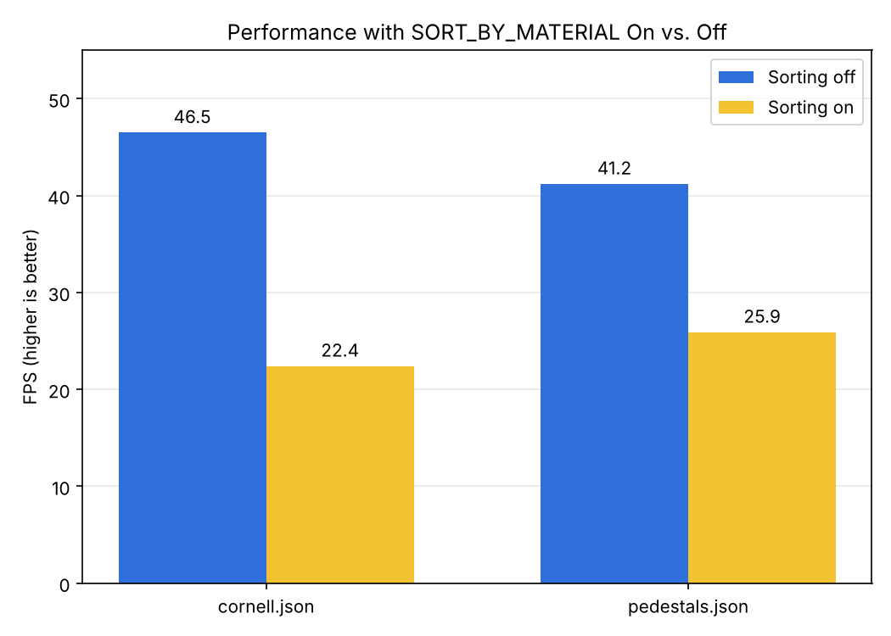
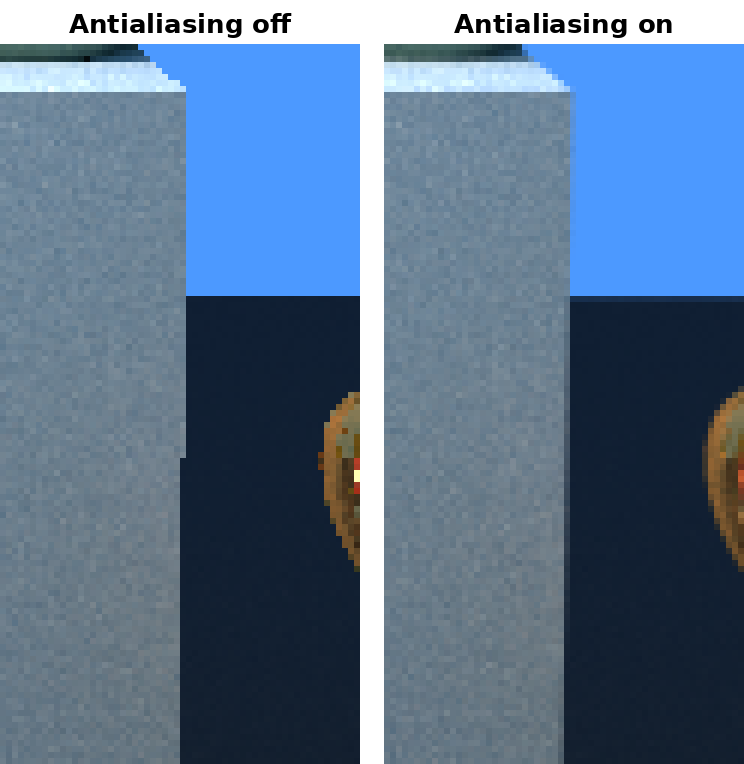
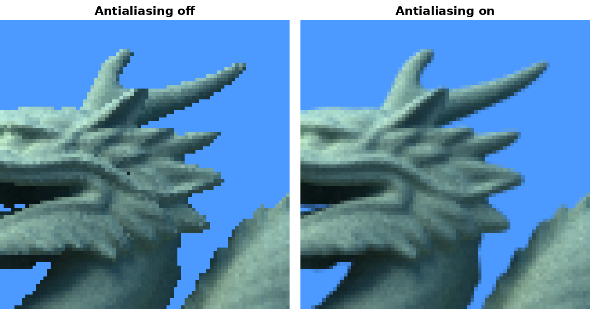
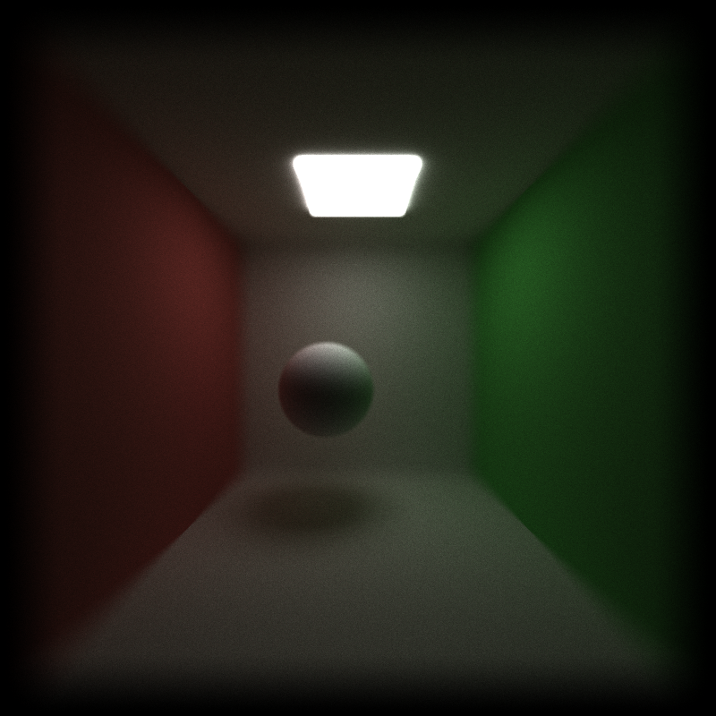
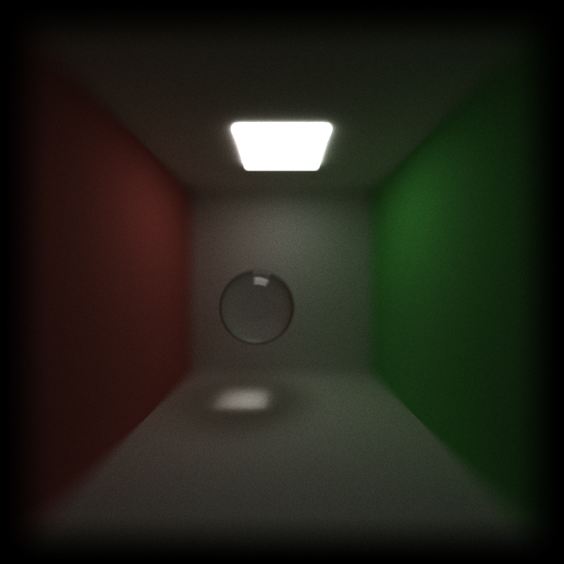
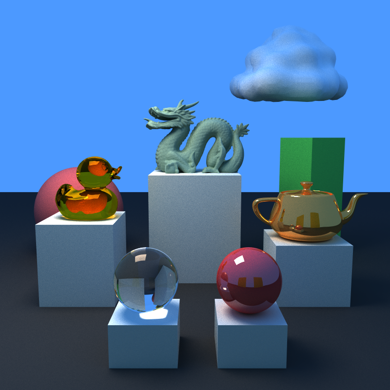
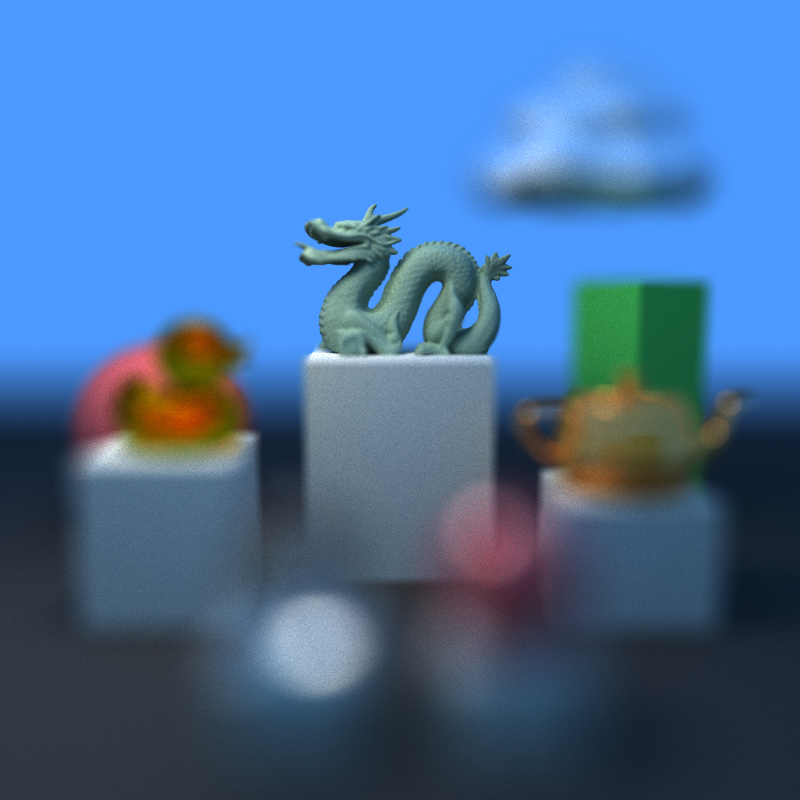
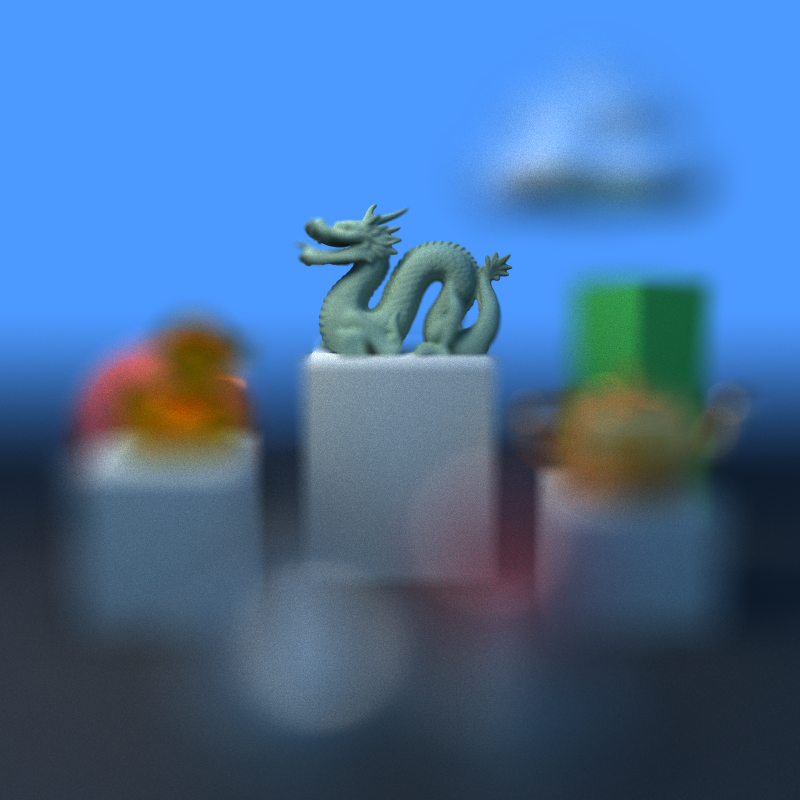
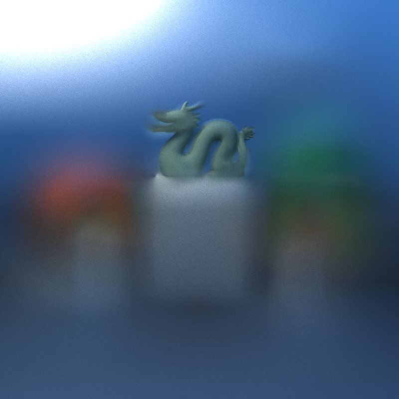

CUDA Path Tracer
================

**University of Pennsylvania, CIS 565: GPU Programming and Architecture, Project 3**

* Ryan Morris
  * [LinkedIn](www.linkedin.com/in/r19)
* Tested on: Windows 11, Intel i7-12700H @ 2.3GHz 64GB, GeForce RTX 3070 Ti Laptop GPU 8GB

## Discussion of Features

### Shading Kernels and Initial Optimizations
- **Shading**: This project's shading is implemented in a new shading kernel `shadeRealMaterial` located in `pathtrace.cu`. This shader, for a given intersection, retrieves the material, and updates the color based on the material's emittance as a termination condition (e.g., reaching a light source), or calculates the ray's next bounce with `scatterRay`
- `scatterRay`, defined in `interactions.cu`, dictates the logic by material
	- For diffuse material, the next direction is sampled from the cosine-weighted direction with the provided `calculateRandomDirectionInHemisphere`
	- For reflective material, the probability of the direction being determined by diffusion (above) and a direct `glm::reflect` (mirror effect, angle in matching angle out) is based on the weighting of the reflect vs. refract color defined in the scene file for that particular type of object
	- For refractive material, see in-depth discussion in a later section

- **Optimization: Sorting paths by material** (`SORT_BY_MATERIAL`): When this optimization flag is set to 1 in the preprocessor instruction, before shading, `thrust::sort_by_key` sorts the intersections and path segments device arrays by `materialId`. This way, threads in the same warp shade the same material where possible.
	- *Analysis:* Test ran on initial settings, 800x800px `scenes/cornell.json` and `scenes/pedestals.json` (the cover image). The former has no gltf mesh renderings, and the latter contains a couple of meshes in addition to basic cube and sphere shapes. The results indicate that this optimization leads to worse performance for these scenes, as the benefit of separating the relatively inexpensive materials (sphere and cube) with cheap evaluations from the meshes introduces more sorting overhead than efficient use of warps. One thing that is clear though is that the performance penalty is less for the pedestal scene, meaning that the inclusion of the triangle geometry mesh is starting to point to the usefulness of the sorting in implementation effeciency

	

- **Optimization: Stream compaction** Instead of having one single kernel gather all colors to write-back to the image at the end, terminated paths (e.g., hits light source, leaves scene) after each bounce, terminated paths (misses, light hits, or no bounces left) are added to the image and removed with `thrust::remove_if`, reducing the number of warps that need to be launched for later iterations, as not all of the initial rays will make it to the end
	- *Analysis*: On the first iteration, here are the number of remaining paths at each bounce (note sorting is off). This was ran on `scenes/cornell.json` . The number of paths quickly decreases on the first few bounces in the initial open cornell box. A modification of the open Cornell box, called `scenes/cornell_closed.json` adds a front wall to the box and places the camera inside the box. Now, because the termination condition is much narrower, most of the rays stay active as they will only stop if they hit the much smaller light rectangle on the box's ceiling

<table>
<tr>
<td>

| Round | Open Box | Closed Box |
|------:|---------:|-----------:|
| 0 | 640,000 | 640,000 |
| 1 | 522,721 | 605,095 |
| 2 | 362,633 | 593,057 |
| 3 | 284,423 | 583,561 |
| 4 | 231,639 | 573,720 |
| 5 | 191,487 | 564,415 |
| 6 | 158,923 | 555,449 |
| 7 | 132,012 | 546,602 |

</td>
<td>

</td>
</tr>
</table>

- **Stochastic sampled antialiasing**: In `generateRayFromCamera` the initial camera rays intersection points are jittered between -0.5 and 0.5 pixels which ensures that pixels landing on the boundaries are blurred between the two materials, creating an antialiasing affect. Below are pictures rendered from the cover scene `scenes/pedestals.json` before and after the anti-aliasing code modification. Most noticable is the difference in the cube geometries, as the lines jag over at a certain point. Additionally, on the more complex glTF renders like the Stanford dragon, you can see the edges look way more jagged

<table align="center">
  <tr>
    <td align="center"> <em>Antialiasing off</em></td>
    <td align="center"> <em>Antialiasing on</em></td>
  </tr>
</table>

### Refraction

- To handle the rendering of refractive surfaces like glass or water, I extended the `scatterRay` helper for the `shadeRealMaterial` kernel. For this feature, sampling must randomly choose between reflection and transmission. [PBR 9.5](https://pbr-book.org/4ed/Reflection_Models/Dielectric_BSDF) illustrates the Dielectric BDSF, which is a combination of the BRDF for specular reflection and BTDF for specular transmission according to the Fresnel formula for dielectrics. The Fresnel formula was referenced in [PBR 9.3.5](https://pbr-book.org/4ed/Reflection_Models/Specular_Reflection_and_Transmission#TheFresnelEquations). This equation is implemented in `FrDielectric` helper in `interactions.cu`. It takes the angle of the intersection to the surface normal `cosThetaI` and `eta` which is equivalent to the `IOR`, assuming the `IOR` of the outside "air" is 1.0. The result of this equation gives the percentage of rays which are reflected using `glm::reflect` across the surface normal. The rays allowed to pass through are handled using `glm::refract (wi, n, eta)` which implements Snell's law, where `wi` is the incoming ray, `n` is the surface normal, and `eta` is IOR_from / IOR_to, meaning it is 1/IOR of the object that we pass into the scene. 
- Sample proportional to Fresnel reflectance R and complementary transmittance 1-R
	- Additional kernel: `FrDielectric` which implements Fresnel equation and Dialectric BSDF from PBR 9.5
- GPU vs CPU: While this was straightforward to add to our `scatterRay` helper of the shading kernel to be implemented in parallel on the GPU, if we were to attempt a CPU-based implementation, we would have to iterate each pixels ray consecutively. However, compared to the base implementation, the branched code for either reflecting or transmitting is friendlier on a CPU because the CPU is able to execute one branch of the code only. In our case, we are now forcing the GPU to complete the Fresnel equation calculation on all pixels, even those without a refractive surface intersection. You can see this in the performance chart below, where enabling the feature in code changed performance. 
- Performance: There was a -2.3% reduction in framerate when switching the simple ball in `scenes\cornell_one.json` from Diffuse to Refractive. As mentioned above, this is likely due to warp divergence and the expense of calculating the Fresnel equation.

| Sphere material | FPS  | Change |
|-----------------|-----:|-------:|
| Diffuse         | 52.2 |      - |
| Refractive      | 51.0 |  -2.3% |

### Depth of Field (TODO)
- In order to simulate a camera with a lens and the focal distance being sharp with the rest blurry, I modified the scene `.json` file template to contain a focal distance and lens size field in the Camera object. Lens size of 0 functions the same as it currently functions, with everything being equally sharp. `generateRayFromCamera` was edited, using [PBR 5.2.3](https://pbr-book.org/4ed/Cameras_and_Film/Projective_Camera_Models#TheThinLensModelandDepthofField) as a reference. The camera ray's initial origin and direction is set via a random `theta` and `r` within the lens disk. The rays direction is set based on the direction between this random point and the focal point, which is calculated as the pinhole ray from the center of the camera to the focal plane, which is the plane `focalDistance` in front of the camera.
- **Performance**: There was a measurable drop in having this feature on vs. having it off (lens radius of 0). FPS dropped about 1 frame. This is due to the extra computation on the GPU at the start of each iteration that can be avoided if we just shoot the ray directly (calculating the focal distance to the plane, etc.). This cost should NOT scale with the lens radius, so it makes sense that the performance with lens radius increasing does not drop off as much as the initial drop in performance from adding the feature. However, increasing the lens radius to the approximate size of the scene (10.0) results in another noticable drop in performance. A potential hypothesis for this is that because the rays at any given camera pixel can be shot from nearly anywhere in the scene, warp divergence is increased because there will be rays on the same warp hitting many different objects. Because of this, I ran a final test with sorting by object type `SORT_BY_MATERIAL` back on with lens radius 10.0. The frame rate was still significantly lower at 25.1 FPS.
- **CPU vs GPU cost difference**: Increasing the lens radius does not have any impact on CPU implementation, as rays are traced one at a time. As described above, it may introduce some warp difference in the GPU implementation which could require other mitigations. For an implementation on either CPU or GPU, the cost of this change is quite little as it only impacts the initial rays at the beginning of each iteration and adds only a few instructions which are less computationally expensive than the shader and intersection finder. 

| Lens radius | FPS (more better)  |
|------------:|-----:|
| 0.0         | 41.4 |
| 0.4         | 40.5 |
| 1.2         | 40.5 |
| 2.0         | 40.1 |
| 10.0        | 38.4 |

<table align="center">
  <tr>
    <td align="center"> <em>Lens radius 0.0</em></td>
    <td align="center"> <em>Lens radius 0.4</em></td>
  </tr>
  <tr>
    <td align="center"> <em>Lens radius 1.2</em></td>
    <td align="center"> <em>Lens radius 2.0</em></td>
  </tr>
  <tr>
    <td align="center" colspan="2"> <em>Lens radius 10.0</em></td>
  </tr>
</table>

### glTF Mesh and BVH Data Structure (TODO)
- Before or after could show performance with a reg box and a glTF box (and show image side by side). Use the other duck / dragon images to showcase after as well.
- This project uses tiny_gltf_v3 to parse GLTF format and convert to Triangles objects set up on the CPU. 
- Triangle intersection tests were added
- Simple bounding box was used so that not every triangle has to be tested if the ray misses, toggled with `BLAH`
- More advanced BVH data structure created as an area of `BVHNode`s on the device (add further discussion of this)
	- Show analysis charts of the performance of both
	- [todo show a chart from timings from nsight for total execution time and improvements in specific kernels]
- CPU vs GPU discussion, also with creating the data structure etc.

## References
- [tinygltf](https://github.com/syoyo/tinygltf) (v3 C API: `tiny_gltf_v3.h`,
  `tiny_gltf_v3.c`, `tinygltf_json_c.h`) for parsing glTF/GLB files.
  Copyright (c) 2017 Syoyo Fujita, Aurélien Chatelain and others
- [Duck](https://github.com/KhronosGroup/glTF-Sample-Assets/tree/main/Models/Duck)
  glTF sample model from the Khronos glTF-Sample-Assets repository.© 2006, Sony.
- [Stanford Dragon](https://graphics.stanford.edu/data/3Dscanrep/)
  model from the Stanford 3D Scanning Repository.
  © Stanford University Computer Graphics Laboratory. Non-commercial research use.
- [Utah Teapot](https://en.wikipedia.org/wiki/Utah_teapot)
  model created by Martin Newell at the University of Utah.
  © 1975, Martin Newell / University of Utah.

